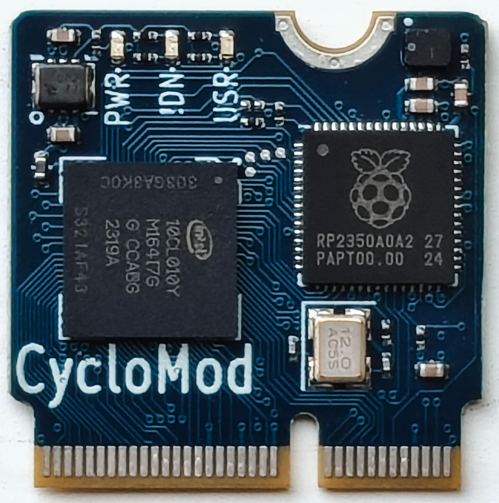

# CycloMod
Cyclone 10LP plus RP2350 in SparkFun MicroMod form-factor

Be sure to subscribe to the [Cyclomod Crowd Supply Campaign](https://www.crowdsupply.com/steiert-solutions/cyclomod) for updates on when and how to get CycloMod.

CycloMod brings the flexibility of an FPGA to the SparkFun MicroMod ecosystem.  It combines the Raspberry Pi RP2350 with the Altera Cyclone 10LP, in a compact, adaptable module.  

The FPGA and MCU are designed to be used together.  Most of the MicroMod I/O are connected to the FPGA for highest flexibility, while some functions like USB, ADC and SWD take advantage of the dedicated peripherals in the RP2350.  A few signals, like reset and the primary I2C bus, are connected to both devices.

Most of the RP2350 I/O are connected to Cyclone 10LP.  The MCU is connected to the JTAG pins of the FPGA so that the same flash can store the MCU firmware and FPGA images to be loaded with the Altera JBC player.  GPIO on the FPGA are connected to the MCU QSPI interface to provide a reasonable speed data path between the two devices.  The HSTX port is also connected for higher speed streaming from the MCU to the FPGA.  Input and Output clocks are also connected between the two devices to allow for sharing the 12MHz refernce crystal from the MCU and PLLs in the FPGA.  

The primary intended use case is for the RP2350 to manage the loading of the FPGA to eliminate the need for an additional storage device.  The active serial configuration pins are connected to the SPI port pins on the MicroMod card edge and there is a solder bridge selector that can be cut and shorted to enable laoding the FPGA from external SPI flash.

FPGA images can be transfered to flash over USB using the UF2 flash loader built into the RP2350 ROM.  Altera provides a [JAM Byte Code player](https://github.com/steieio/altera-jbc-player) that can be used to load the FPGA over JTAG.  A [script is available to combine the JBC file with the RP2350 firmware in a single UF2 file](https://github.com/steieio/jbcuf2).  This methodology was demonstrated in the ["Build a $5 FPGA loader" workshop at Crowd Supply Teardown 2024](https://www.crowdsupply.com/teardown/portland-2024/workshop/build-a-5-fpga-loader).

